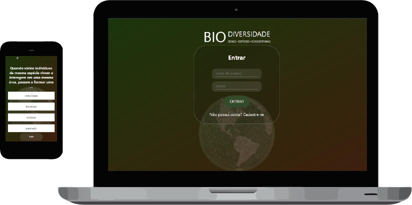

[live-demo-url]: https://biodiversidade.netlify.app/

    
    

<h1 align="center">
    Biodiversidade - Jogo Multiplayer
</h1>

## :memo: Descrição
Biodiversidade é um jogo multiplayer online em formato de quiz em interface web-browser.

## :rocket: Como usar
Para testar a aplicação basta acessar o [link][live-demo-url].
A funcionalidade multiplayer necessitará de dois jogadores para funcionar, porém existe um modo de treinamento onde a jogabilidade pode ser acessada mesmo que individualmente.

## :gear: Processo
### :zap: Motivação:
O jogo foi desenvolvido para ser aplicado em turmas de ensino médio como parte de um projeto em parceria com o IFPA. O projeto visa avaliar a eficiência de jogos educacionais no contexto da biologia.
